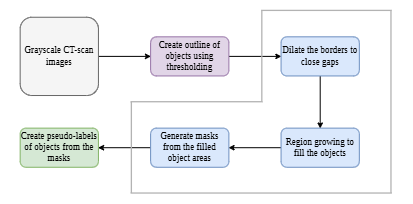
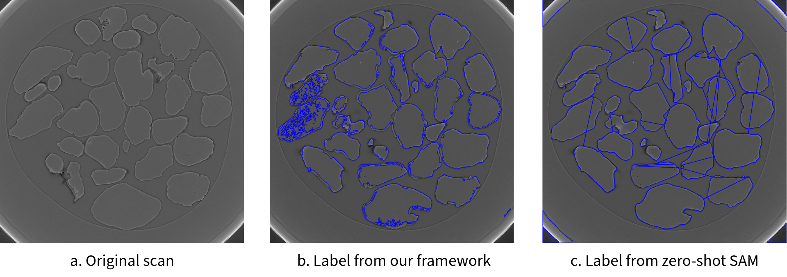
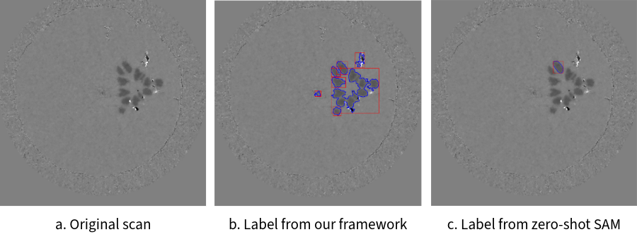
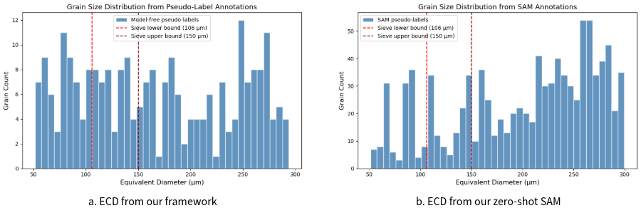
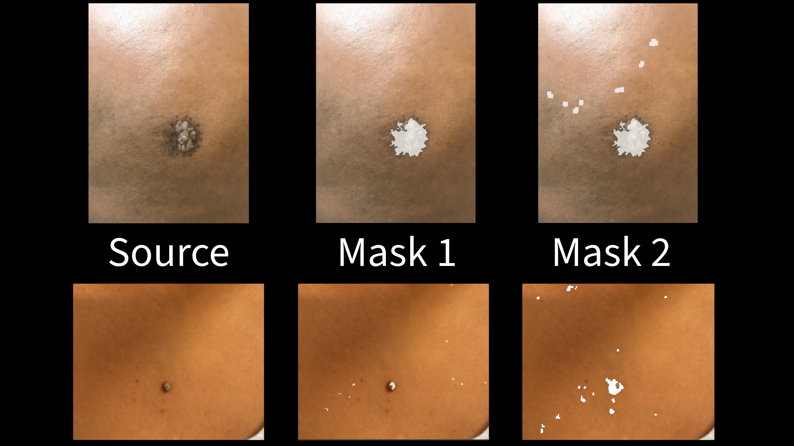

# Model-Free Framework for Pseudo-Label Generation

**A Resource-Efficient and Transparent Model-Free Framework for Pseudo-Label Generation in Material CT Scans**

This repository hosts the source code for the model-free pseudo-label generation from CT scanned images, as 
discussed in the paper **"A Resource-Efficient and Transparent Model-Free Framework for Pseudo-Label Generation in 
Material CT Scans."** The proposed framework establish a transparent approach as a highly effective tool for 
annotation bootstrapping and microstructural quantification in resource-limited environments.

## The Framework
The proposed framework has three key sections as displayed in the figure below.

  
_Figure: The three key sections of the proposed framework for pseudo-label generation._

In **step one** we use traditional image processing techniques to generate labels and outlines from grayscale images 
(e.g. CT scans).

In **step two** we dilate the outlines and use a custom threshold-based BFS algorithm for region growing. This 
custom algorithm creates masks for regions of interest (ROIs) in the images.

In **step three** we use the generated masks to create pseudo-labels for the original grayscale images. These 
pseudo-labels can then be used for training machine learning models for downstream segmentation tasks.

## Experiments
Experiments on different datasets prove the efficiency of the proposed framework. The proposed approached produced 
comparable results to state-of-the-art foundation models running on GPU, while using only CPU resources and taking 
only half the time.

### Sand Grain Dataset
Experiment on the APS Sand Grain Dataset [(Detail ↗)](https://doi.org/10.1016/j.compgeo.2020.103718) shows that the 
proposed framework can generate high-quality pseudo-labels for sand grain images.

  
_Figure: The original grayscale CT scan image (left), the generated pseudo-label using our method (middle), and the 
generated pseudo-label using zero-shot SAM (right)._

The pseudo-labels were generated 2x faster on CPU compared to the zero-shot SAM model running on GPU, while 
producing comparable results. Downstream segmentation tasks from the generated pseudo-labels also produced 
comparable results to the zero-shot SAM model. We trained YOLOv11 model using both the pseudo-labels to compare the 
results.

_Table: Comparison of the proposed model-free framework with zero-shot SAM on the APS Sand Grain Dataset._  

| Method | Parameters(Mi) | CPU | GPU | RAM | Time(sec) |  
|--------|----------------|-----|-----|-----|-----------|
| Model-free | $-$ | $\checkmark$ | $\times$ | $\checkmark$ | $15/im$   |  
| SAM | $80.9$ | $\checkmark$ | $\checkmark$ | $\checkmark$ | $28/im$   |

### Dendrites Dataset
Experiment on the Dendrites Dataset [(Detail ↗)](https://doi.org/10.18126/M2RM08) shows that the proposed framework 
can generate high-quality pseudo-labels on even lower contrast images.

    
_Figure: The original grayscale CT scan image (left), the generated pseudo-label using our method (middle), and the 
generated pseudo-label using zero-shot SAM (right)._

_Table: Comparison of the proposed model-free framework with zero-shot SAM on the Dendrites Dataset._

| Method | Accuracy | IoU | F1 |
|--------|----------|-----|----|
| SAM | $98.63%$ | $10.74%$ | $19.39%$ |
| Model-free | $99.12%$ | $63.19%$ | $77.44%$ |

### Microstructure Quantification
The proposed framework performed well in microstructure quantification tasks, producing comparable results to the 
zero-shot SAM model. This experiment proves the effectiveness of the framework in resource-limited materials science 
experiments.

    
_Figure: Effective circular diameter (ECD) comparison between the proposed model-free framework and zero-shot SAM on 
sand grains._

### Dermatology Dataset
Beyond materials dataset and grayscale CT scans, the algorithm can be tuned to work on a diverse environment. A 
quick experiment on Diverse Dermatology Images (DDI) dataset 
[(Detail ↗)](https://doi.org/10.71718/kqee-3z39), produced appropriate masks for ROIs on diverse skin tones.

  
_Figure: Pseudo-label generation on sample DDI data._

## Directory Structure
The directory structure of the repository is as follows:
```
├── figures/                        # Contains the figures used in the paper and README
|── generate_pseudo_label.ipnyb     # A Jupyter notebook for generating pseudo-labels from CT scans
|── PseudoLabelAnnotation.py        # A Python class implementation of the proposed framework for pseudo-label generation
|── utility.py                      # A utility file containing helper functions used in the class
|── README.md                       # This README file
```

## Citation
The complete work is currently under review for publication. If you find this work useful in your research, please 
consider citing:

```bibtex
@article{Rahman2026cv,
  title={A Resource-Efficient and Transparent Model-Free Framework for Pseudo-Label Generation in Material CT Scans},
  author={Rahman, Ashiqur; Seethi, Venkata Devesh Reddy; Yunker, Austin; Kettimuthu, Rajkumar; and Alhoori, Hamed;},
  year={2026}
}
```
